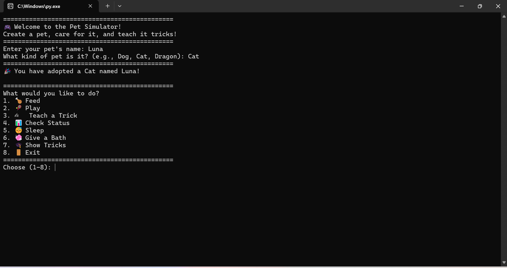
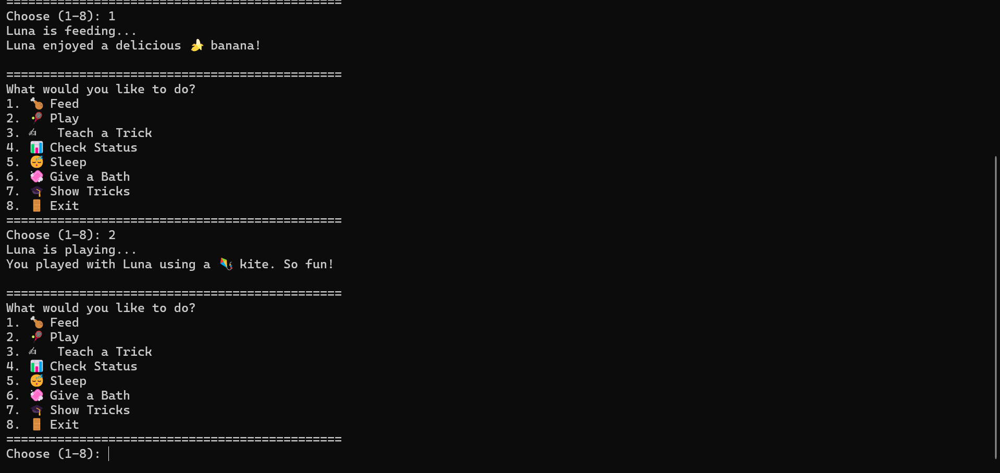
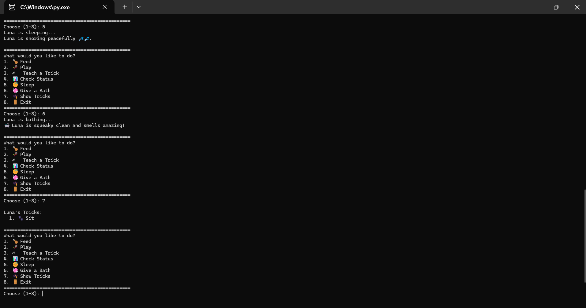
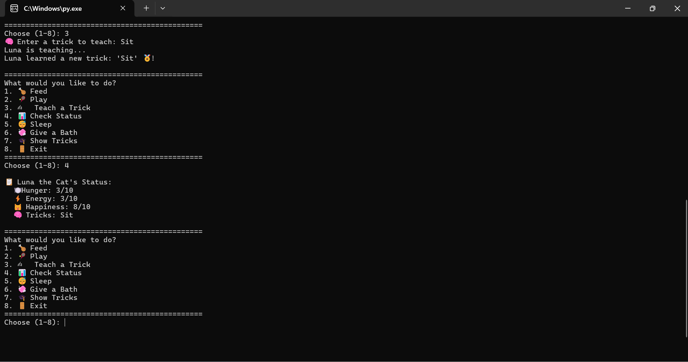

# 🐾 Virtual Pet Simulator 🎮

Welcome to the **Pet Simulator**, a cute, interactive command-line game built using Python's Object-Oriented Programming concepts! Whether you're feeding your fur baby, teaching it tricks, or just having fun—this game has it all. Perfect for beginners! 🎉

---

## 🧠 Features

- 🐕 Create and name your very own pet
- 🐾 Choose a pet species (dog, cat, dragon—you name it!)
- 🍖 Feed your pet random foods
- ⚽ Play with random toys to boost happiness
- ✨ Teach your pet awesome tricks
- 🛁 Give your pet a refreshing bath
- 😴 Let your pet rest and recharge
- 📊 View your pet's current status and mood
- 💬 Enjoy emoji-powered feedback to keep things fun

---

## 🚀 How to Run

1. Clone the repository  
   ```bash
   git clone https://github.com/Junewahu/OOP-Challenge-Group-468
   cd OOP-Challenge

## 🖼️ Screenshots

👶 Creating Your Pet



🍽️ Feeding & ⚽ Playing



💤 Sleep & 🛁 Bath Time + 🎩 Tricks Reveal



🧠 Status Check + 🎓 Teaching New Tricks



## Developers
Created by group 468:
june	mwangi - junewahu@gmail.com
victor	mikae	- mikaev135@gmail.com
evans	mugendi - acemugendi6@gmail.com
bolly kevin	echessa - bollykevin75@gmail.com
gift	odoyo	- otienogift1@gmail.com
stellah	wycliff - stellahdaniel71@gmail.com
sibongakonke	bhengu- snbhengu08@gmail.com
ambuche	david	- ddoronje25@gmail.com
nicole	ochieng	- nicoleochieng7@gmail.com

